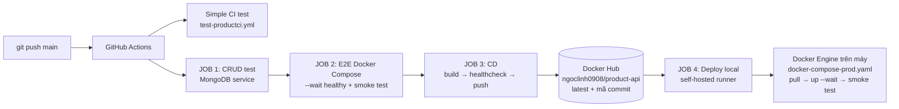

Product API: RESTful CRUD với Docker và CI/CD


RESTful API quản lý sản phẩm (Product: `pid`, `pname`, `price`, `quantity`), xây dựng bằng Node.js, Express và Mongoose, lưu dữ liệu trên MongoDB. Dự án được đóng gói bằng Docker, chạy bằng Docker Compose có healthcheck, và triển khai tự động qua quy trình CI/CD với GitHub Actions → Docker Hub → Docker Engine trên máy.
> Bài tập **Prompt 1: CI/CD**, IUH.
---
Mục lục
Công nghệ sử dụng
Kiến trúc tổng quan
Cấu trúc thư mục
Model Product
Danh sách API
Cấu hình môi trường (.env)
Chạy dự án
Kiểm thử
Healthcheck
Quy trình CI/CD
Lệnh kiểm tra nhanh
---
1. Công nghệ sử dụng
Thành phần	Công nghệ
Runtime	Node.js 24
Web framework	Express 5
Database	MongoDB 8.0
ODM	Mongoose 9
Cấu hình	dotenv (`.env`)
Logging	morgan
Kiểm thử	`node:test` (test runner có sẵn của Node.js)
Container	Docker, Docker Compose
CI/CD	GitHub Actions, Docker Hub, GitHub self-hosted runner
---
2. Kiến trúc tổng quan
Kiến trúc ứng dụng (đa tầng)
```
 Client (Postman / curl)
        │  HTTP JSON
        ▼
 ┌──────────────── product-api (Express) ────────────────┐
 │  app.js        : middleware (morgan, json), /health,  │
 │                  404, error handler                    │
 │  routes/       : ánh xạ URL → controller               │
 │  controllers/  : xử lý nghiệp vụ CRUD                  │
 │  models/       : Mongoose Schema + validation          │
 └──────────────────────────┬────────────────────────────┘
                            │ Mongoose
                            ▼
                 MongoDB (container nammongodb)
                 database: productdb / collection: products
```
Kiến trúc triển khai (Docker Compose)
```
 ┌──────────────── Docker Engine ─────────────────────────┐
 │  network: product-network / product-prod-network       │
 │  ┌───────────────────┐        ┌─────────────────────┐  │
 │  │ product-api       │───────▶│ nammongodb          │  │
 │  │ :3000 (healthy)   │ mongodb│ mongo:8.0 (healthy) │  │
 │  └─────────┬─────────┘ :27017 └──────────┬──────────┘  │
 └────────────┼─────────────────────────────┼─────────────┘
              │ -p 3000:3000                │ volume: nammongodb_data
       localhost:3000                (dữ liệu được giữ lại)
```
---
3. Cấu trúc thư mục
```
product-api/
├── .github/workflows/
│   ├── test-productci.yml        # CI đơn giản (không cần DB)
│   └── test-productci-prod.yml   # CI CRUD + MongoDB, E2E, CD Docker Hub, deploy máy local
├── controllers/
│   └── productController.js      # xử lý CRUD
├── models/
│   └── product.js                # Mongoose Schema Product
├── routes/
│   └── productRoutes.js          # định tuyến /api/products
├── scripts/
│   └── smoke-test.js             # smoke test CRUD trên API đang chạy
├── tests/
│   ├── app.test.js               # 3 test cơ bản (không cần DB)
│   └── product.crud.test.js      # 12 test CRUD với MongoDB thật
├── app.js                        # cấu hình Express, kết nối MongoDB
├── Dockerfile                    # đóng gói image (có HEALTHCHECK)
├── .dockerignore
├── docker-compose.yml            # môi trường DEV (build từ mã nguồn)
├── docker-compose-prod.yaml      # môi trường PROD (image từ Docker Hub)
├── .env.example                  # mẫu cấu hình (.env thật KHÔNG đưa lên GitHub)
├── .gitignore
├── package.json
└── package-lock.json
```
---
4. Model Product
Trường	Kiểu	Ràng buộc
`pid`	String	Bắt buộc, duy nhất (unique index), tự bỏ khoảng trắng
`pname`	String	Bắt buộc, tự bỏ khoảng trắng
`price`	Number	Bắt buộc, `>= 0`
`quantity`	Number	Bắt buộc, `>= 0`, số nguyên (custom validator)
`createdAt`, `updatedAt`	Date	Tự động (`timestamps: true`)
Collection trên MongoDB: `products` (Mongoose tự chuyển `Product` thành số nhiều, chữ thường).
---
5. Danh sách API
Base URL: `http://localhost:3000`
Method	Endpoint	Mô tả	Thành công
GET	`/`	Kiểm tra API đang chạy	200
GET	`/health`	Tình trạng API + kết nối MongoDB	200 / 503
GET	`/api/products`	Lấy tất cả sản phẩm (sắp xếp theo `pid`)	200
GET	`/api/products/:pid`	Lấy 1 sản phẩm theo `pid`	200
POST	`/api/products`	Tạo sản phẩm mới	201
PUT	`/api/products/:pid`	Cập nhật sản phẩm (không sửa `pid`)	200
DELETE	`/api/products/:pid`	Xóa sản phẩm	200
Ví dụ tạo sản phẩm
```http
POST /api/products
Content-Type: application/json

{ "pid": "P001", "pname": "Ban phim co", "price": 350000, "quantity": 10 }
```
Mã lỗi
Mã	Khi nào
400	Dữ liệu sai (giá âm, số lượng lẻ, sai kiểu) hoặc JSON sai cú pháp
404	Không tìm thấy sản phẩm hoặc đường dẫn
409	Trùng `pid`
503	`/health`: mất kết nối MongoDB
500	Lỗi máy chủ khác
---
6. Cấu hình môi trường (.env)
Tạo file `.env` từ file mẫu:
```bash
cp .env.example .env
```
Biến	Ví dụ	Ý nghĩa
`PORT`	`3000`	Cổng API
`URL_MONGO`	`mongodb://127.0.0.1:27017/`	Địa chỉ MongoDB
`DATABASE_NAME`	`productdb`	Tên database
Chuỗi kết nối được ghép trong code: `URL_MONGO + DATABASE_NAME`.
> `.env` nằm trong `.gitignore`, **không** được đưa lên GitHub, và nằm trong `.dockerignore` nên **không** được đóng gói vào image. Khi chạy bằng Docker Compose, `URL_MONGO` được ghi đè thành `mongodb://mongodb:27017/` (gọi MongoDB bằng **tên service**).
---
7. Chạy dự án
Yêu cầu: Docker Desktop, Git, Node.js 24 (chỉ cần khi chạy hoặc test ngoài Docker).
Cách 1: Production, chạy image từ Docker Hub (khuyến nghị)
Không cần mã nguồn, không cần build, chỉ cần file `docker-compose-prod.yaml`:
```bash
docker compose -f docker-compose-prod.yaml up -d
docker ps          # đợi ~30 giây: cả 2 container (healthy)
```
Cách 2: Development, build từ mã nguồn
```bash
git clone https://github.com/ngoclinh090608-wq/product-api.git
cd product-api
cp .env.example .env
docker compose up -d --build
```
> Sửa mã nguồn (`.js`) thì chạy lại `docker compose up -d --build` để build image mới.
> Dev và Prod dùng chung tên container và cổng, nên chỉ chạy **một** môi trường tại một thời điểm:
> `docker compose down` (tắt dev) hoặc `docker compose -f docker-compose-prod.yaml down` (tắt prod).
Cách 3: Chạy trực tiếp bằng Node.js (cần MongoDB ở cổng 27017)
```bash
npm install
npm run dev
```
---
8. Kiểm thử
Lệnh	Nội dung	Cần gì
`npm test`	3 test cơ bản: `/`, `/health` (503 khi chưa có DB), route 404	Không cần DB
`npm run test:crud`	12 test CRUD đầy đủ (tạo, trùng 409, sai dữ liệu 400, JSON lỗi 400, đọc, sửa, xóa, kiểm tra DB)	MongoDB ở `127.0.0.1:27017`
`npm run test:smoke`	Smoke test CRUD qua HTTP vào API đang chạy (container)	API ở `localhost:3000`
`test:crud` dùng database riêng `productdb_test` và tự xóa sau khi chạy, nên không ảnh hưởng dữ liệu thật.
`test:smoke` tạo sản phẩm `SMOKE<timestamp>` rồi tự xóa.
---
9. Healthcheck
Container	Lệnh kiểm tra	Chu kỳ
`nammongodb`	`mongosh --eval "db.adminCommand('ping').ok"`	10s, retries 5
`product-api`	`wget -qO- http://127.0.0.1:3000/health`	10s, retries 3
`/health` trả 200 khi đã kết nối MongoDB, trả 503 khi mất kết nối, nên container báo `unhealthy` khi DB gặp sự cố.
`product-api` chỉ khởi động khi `nammongodb` đã healthy (`depends_on: condition: service_healthy`).
Healthcheck có cả trong `Dockerfile` (`HEALTHCHECK`), nên image kéo từ Docker Hub cũng tự mang theo.
```bash
docker ps                                                     # cột STATUS: (healthy)
docker inspect --format "{{.State.Health.Status}}" product-api
curl localhost:3000/health                                    # {"status":"ok","database":"connected"}
```
---
10. Quy trình CI/CD

Workflow `test-productci.yml`: CI đơn giản
Checkout → Setup Node 24 → `npm ci` → kiểm tra cú pháp → `npm test` → `docker build`.
Workflow `test-productci-prod.yml`: CI/CD cho bản triển khai thực tế
Job	Chạy trên	Nội dung
1. CRUD test with MongoDB	`ubuntu-latest` + service `mongo:8.0`	`npm test`, `npm run test:crud` với MongoDB thật trên máy ảo GitHub
2. E2E test on Docker Compose	`ubuntu-latest`	`docker compose up --build --wait` (đợi healthy), `npm run test:smoke`, in log
3. CD - Healthcheck & push to Docker Hub	`ubuntu-latest`	Build image 2 tag (`latest`, mã commit 7 ký tự), chạy thử và đợi `healthy`, rồi mới `docker login` và `docker push`
4. CD - Deploy to Local Docker Engine	self-hosted runner (máy Windows)	`docker compose -f docker-compose-prod.yaml pull`, `up -d --wait`, smoke test
Job sau chỉ chạy khi job trước thành công (`needs`). Test fail thì pipeline dừng, image lỗi không được push.
Job 3 và 4 chỉ chạy khi push vào `main`, pull request chỉ chạy CI.
Cấu hình cần có
GitHub Secrets (Settings → Secrets and variables → Actions):
Secret	Giá trị
`DOCKERHUB_USERNAME`	Tên tài khoản Docker Hub
`DOCKERHUB_TOKEN`	Personal Access Token Docker Hub (quyền Read & Write)
Self-hosted runner (cho Job 4):
```powershell
# Windows PowerShell - cài 1 lần theo hướng dẫn tại:
# GitHub repo → Settings → Actions → Runners → New self-hosted runner (Windows x64)
cd C:\actions-runner
.\config.cmd --url https://github.com/ngoclinh090608-wq/product-api --token <TOKEN>
#   labels thêm: local-docker  |  run as service: N

# Mỗi lần sử dụng:
.\run.cmd          # → Listening for Jobs
```
Runner cần các nhãn `self-hosted`, `Windows`, `local-docker`, và máy phải đang bật Docker Desktop.
---
11. Lệnh kiểm tra nhanh
```bash
docker ps                                              # danh sách container + (healthy)
docker compose ps                                      # container theo project
docker logs product-api                                # log API (morgan)
docker exec -it nammongodb mongosh productdb           # vào MongoDB
    db.products.find()                                 #   xem dữ liệu
    exit
curl localhost:3000/health                             # healthcheck
npm run test:crud                                      # test CRUD
npm run test:smoke                                     # smoke test container
```
---
Tác giả
Ngoc Linh (@ngoclinh090608-wq)
